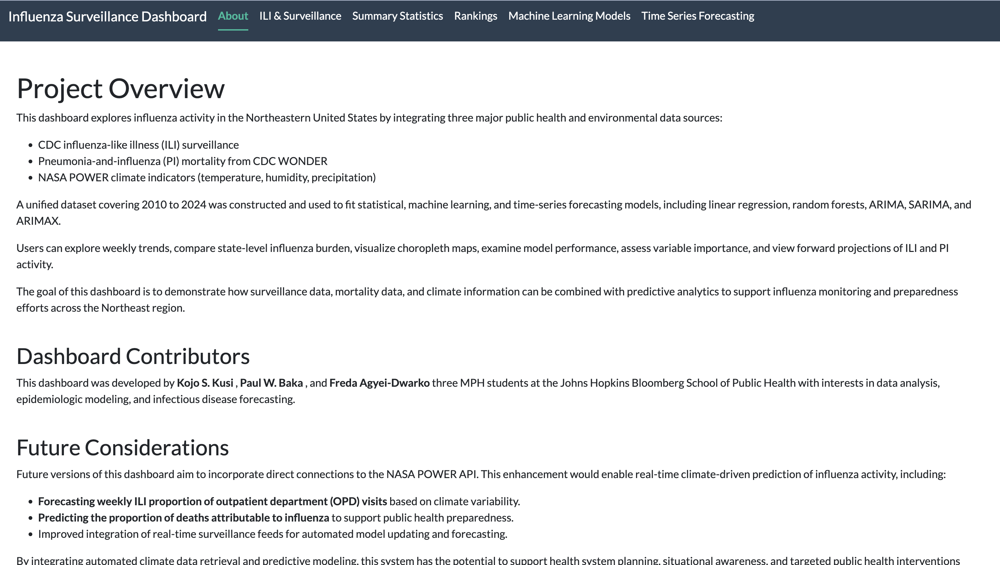

# influenza-surveillance-dashboard
Team: DataRx

Team members: Kojo S. Kusi, Paul W. Baka, Freda Agyei-Dwarko

Our main data analytic product, a Shiny app, has also been deployed: **[https://nam02.safelinks.protection.outlook.com/?url=https%3A%2F%2Fkkusi12.shinyapps.io%2FStatsProgramming%2F&data=05%7C02%7Cpbaka1%40jh.edu%7C5553dc423b2a41547b3108de37a5fafc%7C9fa4f438b1e6473b803f86f8aedf0dec%7C0%7C0%7C639009383175424916%7CUnknown%7CTWFpbGZsb3d8eyJFbXB0eU1hcGkiOnRydWUsIlYiOiIwLjAuMDAwMCIsIlAiOiJXaW4zMiIsIkFOIjoiTWFpbCIsIldUIjoyfQ%3D%3D%7C0%7C%7C%7C&sdata=0Qm5ObB0YpFwtvt8QwdpmNRPdG%2BPdawxZwWkUqA5bfw%3D&reserved=0]**

Link to the dashboard github repo : **(https://github.com/Kojo-Kusi/FluClimate-Shiny-Dashboard-Repo)**

A write-up of this final project is also included in this repo, with the file name: **[`Project-write-up.pdf`]**

---

## Overview
This project provides an accessible, interactive dashboard for monitoring influenza activity in the Northeastern United States by integrating three major public health and environmental data sources:

- **CDC influenza-like illness (ILI)** surveillance
- **Pneumonia-and-influenza (PI)** mortality from **CDC WONDER**
- **NASA POWER** climate indicators (temperature, humidity, precipitation)

A unified weekly dataset (2010–2024) was constructed to support exploratory analysis and predictive modeling. The dashboard allows users to explore weekly trends, compare state-level influenza burden, visualize choropleth maps, examine model performance, assess variable importance, and view forecasts of ILI and PI signals.

---

## Key Features of the Project
- **User-Friendly Interface:** Clear navigation with tabs and simple inputs (state, year, metric/model).
- **Integrated Surveillance View:** Combines ILI, PI mortality, and climate information in one tool.
- **Exploratory Analytics:** Weekly time-series plots, state rankings, and choropleth maps for spatial patterns.
- **Predictive Modeling:** Comparison of models across pre-pandemic, pandemic, and post-pandemic periods.
- **Forecasting:** ARIMA-based projections with prediction intervals for time-series behavior.

---

## Data and Tools
**Data sources**
- CDC ILI surveillance (weekly, state-level)
- CDC WONDER PI mortality (weekly)
- NASA POWER climate indicators (weekly summaries)

**Tools / packages (examples)**
- Shiny, bslib, ggplot2, plotly, DT
- DBI + RSQLite (SQLite database storage/querying)
- tidymodels (LM + RF workflows)
- forecast (ARIMA)

---

## Programming Paradigms
- **Database-backed workflows:** SQLite + DBI/RSQLite used to store and query cleaned tables consistently.
- **Functional/modular programming:** Pipeline organized into reusable steps for data prep and modeling.
- **Machine learning:** Random forest models for nonlinear prediction and variable importance.
- **Statistical modeling:** Linear regression as an interpretable baseline.
- **Time-series forecasting:** ARIMA models trained on pre-pandemic patterns and evaluated under regime shifts.

---

## Shiny App Structure

### App Overview (About page)
Below is the About page screenshot of the deployed dashboard:




### Tabs / Pages
- **About:** Project overview, data sources, contributors, and future considerations.
- **ILI & Surveillance:** Explore influenza activity measures and related indicators.
- **Summary Statistics:** Weekly trends for selected state/year + choropleth maps.
- **Rankings:** Compare states by selected metric for a chosen year.
- **Machine Learning Models:** LM vs RF performance + RF variable importance.
- **Time Series Forecasting:** ARIMA forecasts with prediction intervals.

---

## How to Run Locally
1) Install required packages in R:
```r
install.packages(c(
  "shiny","bslib","dplyr","ggplot2","plotly","DT",
  "DBI","RSQLite","janitor","lubridate",
  "recipes","parsnip","workflows","yardstick","rsample",
  "ranger","forecast"
))
